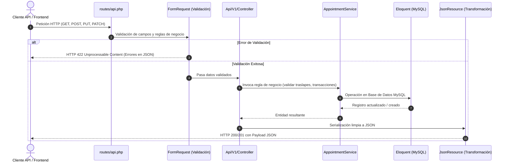

# Documentación Técnica: Rama `feature/api-rest-citas`

**Módulo:** Control de Citas Médicas y Catálogos Clínicos (HIS)  
**Rama:** `feature/api-rest-citas`  
**Fecha de Implementación:** Septiembre 2026  
**Tecnologías:** Laravel 12, RESTful API, Eloquent ORM, JSON Resources, Form Requests, MySQL 8.0 Docker  

---

## 1. Resumen de lo Realizado en la Rama

En esta rama se implementó la capa completa de servicios y endpoints **RESTful (v1)** para la administración del ciclo de vida de citas médicas y la consulta de catálogos clínicos:

1. **Gestión Integral de Citas Médicas**:
   - **Crear / Agendar**: Validación automática de no traslape de horario para el médico mediante `AppointmentService`.
   - **Listado y Filtros**: Paginación y filtrado dinámico por fecha, doctor, paciente y estado (`status`).
   - **Consulta de Detalle**: Respuesta enriquecida con información anidada del paciente, médico, especialidad y trazabilidad.
   - **Actualización General**: Modificación de motivo, notas clínicas o cambio de médico/horario con validación de disponibilidad.
   - **Reprogramación**: Cambio de fecha/hora con registro obligatorio de motivo (`reschedule_reason`) y timestamp (`rescheduled_at`).
   - **Cancelación**: Cambio de estado a `cancelled` con justificación obligatoria (`cancellation_reason`), timestamp (`cancelled_at`) y liberación inmediata del cupo horario.
   - **Cambio Directo de Estado**: Transición de estado (`confirmed`, `attended`, `no_show`, etc.) con notas de auditoría clínica.

2. **Endpoints de Lectura de Catálogos Clínicos**:
   - **Médicos (`/doctors`)**: Listado con especialidad, conteo de citas asignadas (`appointments_count`), filtros y búsqueda por nombre o colegiado. Detalle con listado de sus próximas 10 citas agendadas (`upcoming_appointments`).
   - **Pacientes (`/patients`)**: Catálogo con búsqueda por nombre, expediente (`medical_record_number`) o DPI (`identification_number`). Detalle con historial de citas previas (`appointments_history`).
   - **Especialidades (`/specialties`)**: Listado de especialidades médicas activas.

---

## 2. Estructura de Archivos Creados y Modificados

```
app/
├── Http/
│   ├── Controllers/Api/V1/
│   │   ├── AppointmentApiController.php    # [MODIFICADO] Métodos CRUD, reprogramar, cancelar y cambiar estado
│   │   ├── DoctorApiController.php         # [NUEVO] Lectura, búsqueda y detalle con próximas citas
│   │   ├── PatientApiController.php        # [NUEVO] Lectura, búsqueda y detalle con historial de citas
│   │   └── SpecialtyApiController.php      # [NUEVO] Lectura de especialidades activas
│   ├── Requests/Appointments/
│   │   ├── StoreAppointmentRequest.php     # Validación para agendar
│   │   ├── UpdateAppointmentRequest.php    # [NUEVO] Validación para actualizar cita
│   │   ├── RescheduleAppointmentRequest.php# Validación de reprogramación
│   │   ├── CancelAppointmentRequest.php    # Validación de cancelación con justificación
│   │   └── ChangeAppointmentStatusRequest.php # [NUEVO] Validación para cambiar estado
│   └── Resources/V1/
│       ├── AppointmentResource.php         # Transformación estándar de cita médica
│       ├── DoctorResource.php              # [NUEVO] Transformación de datos de médico
│       ├── PatientResource.php             # [NUEVO] Transformación de expediente de paciente
│       └── SpecialtyResource.php           # [NUEVO] Transformación de especialidad
├── Services/
│   └── AppointmentService.php              # [MODIFICADO] Métodos updateAppointment() y changeStatus()
routes/
└── api.php                                 # [MODIFICADO] Definición de rutas REST v1
doc/
├── README.md                               # [MODIFICADO] Índice general de documentación
└── api-rest-citas/
    └── README.md                           # [NUEVO] Manual técnico detallado de la rama
```

---

## 3. Arquitectura del Flujo de Peticiones



---

## 4. Detalle de Cambios en la Capa de Servicio (`AppointmentService.php`)

Se incorporaron dos métodos esenciales para el control de citas:

### 4.1. `updateAppointment(Appointment $appointment, array $data): Appointment`
Permite editar campos de una cita. Si la petición incluye nueva fecha, hora de inicio, hora de fin o cambio de médico, invoca `ensureDoctorIsAvailable()` excluyendo el ID de la cita actual para verificar que no colisione con otra cita programada.

### 4.2. `changeStatus(Appointment $appointment, string $status, ?string $note, ?string $cancellationReason): Appointment`
Ejecuta una transacción en MySQL para cambiar el estado mediante el Enum `AppointmentStatus`. Si el estado pasa a `cancelled`, asigna automáticamente el motivo y el timestamp `cancelled_at`. Permite anexar notas clínicas de trazabilidad.

---

## 5. Catálogo de Endpoints RESTful (`/api/v1`)

### 5.1. Citas Médicas

| Método | Endpoint | Parámetros Clave | Código Éxito |
| :--- | :--- | :--- | :---: |
| `GET` | `/api/v1/appointments` | Query: `date`, `doctor_id`, `patient_id`, `status`, `per_page` | `200 OK` |
| `POST` | `/api/v1/appointments` | Body: `patient_id`, `doctor_id`, `specialty_id`, `appointment_date`, `start_time`, `end_time`, `reason` | `201 Created` |
| `GET` | `/api/v1/appointments/{id}` | Path: `id` | `200 OK` |
| `PUT/PATCH`| `/api/v1/appointments/{id}` | Body: `reason`, `clinical_notes`, `appointment_date`, `start_time`, `end_time` | `200 OK` |
| `PUT/PATCH`| `/api/v1/appointments/{id}/reschedule` | Body: `appointment_date`, `start_time`, `end_time`, `reschedule_reason` | `200 OK` |
| `PUT/PATCH`| `/api/v1/appointments/{id}/cancel` | Body: `cancellation_reason` | `200 OK` |
| `PATCH` | `/api/v1/appointments/{id}/status` | Body: `status` (`confirmed`, `attended`, `no_show`, etc.), `note` | `200 OK` |

### 5.2. Médicos (Lectura)

| Método | Endpoint | Parámetros Clave | Código Éxito |
| :--- | :--- | :--- | :---: |
| `GET` | `/api/v1/doctors` | Query: `specialty_id`, `is_active`, `search`, `per_page` | `200 OK` |
| `GET` | `/api/v1/doctors/{id}` | Path: `id` (Retorna doctor y sus `upcoming_appointments`) | `200 OK` |

### 5.3. Pacientes (Lectura)

| Método | Endpoint | Parámetros Clave | Código Éxito |
| :--- | :--- | :--- | :---: |
| `GET` | `/api/v1/patients` | Query: `search` (nombre, DPI, expediente), `gender`, `per_page` | `200 OK` |
| `GET` | `/api/v1/patients/{id}` | Path: `id` (Retorna expediente y su `appointments_history`) | `200 OK` |

### 5.4. Especialidades (Lectura)

| Método | Endpoint | Parámetros Clave | Código Éxito |
| :--- | :--- | :--- | :---: |
| `GET` | `/api/v1/specialties` | Ninguno (Devuelve lista de especialidades activas) | `200 OK` |

---

## 6. Ejemplos de Peticiones y Respuestas

### 6.1. Agendar Cita Médica
`POST /api/v1/appointments`

**Headers:**
```http
Content-Type: application/json
Accept: application/json
```

**Body (JSON):**
```json
{
  "patient_id": 1,
  "doctor_id": 1,
  "specialty_id": 1,
  "appointment_date": "2026-10-15",
  "start_time": "09:00",
  "end_time": "09:30",
  "reason": "Evaluación por presión arterial elevada",
  "clinical_notes": "Paciente requiere electrocardiograma de control."
}
```

**Respuesta Exitosa (`201 Created`):**
```json
{
  "id": 4,
  "code": "CITA-202609-AB789",
  "status": {
    "value": "pending",
    "label": "Pendiente"
  },
  "date": "2026-10-15",
  "start_time": "09:00",
  "end_time": "09:30",
  "reason": "Evaluación por presión arterial elevada",
  "clinical_notes": "Paciente requiere electrocardiograma de control.",
  "patient": {
    "id": 1,
    "full_name": "Mario López",
    "medical_record_number": "EXP-2026-0001",
    "phone": "+502 4444-1111"
  },
  "doctor": {
    "id": 1,
    "full_name": "Dr. Carlos Mendoza",
    "specialty": "Cardiología",
    "consulting_room": "Edificio A - Consultorio 204"
  }
}
```

---

### 6.2. Reprogramar Cita Médica
`PUT /api/v1/appointments/1/reschedule`

**Body (JSON):**
```json
{
  "appointment_date": "2026-10-20",
  "start_time": "10:00",
  "end_time": "10:30",
  "reschedule_reason": "Paciente solicitó cambio de horario por motivos laborales."
}
```

**Respuesta Exitosa (`200 OK`):**
```json
{
  "success": true,
  "message": "Cita médica reprogramada exitosamente.",
  "data": {
    "id": 1,
    "code": "CITA-202609-001",
    "status": {
      "value": "rescheduled",
      "label": "Reprogramada"
    },
    "date": "2026-10-20",
    "start_time": "10:00",
    "end_time": "10:30",
    "reschedule_reason": "Paciente solicitó cambio de horario por motivos laborales.",
    "rescheduled_at": "2026-09-19T07:44:00.000000Z"
  }
}
```

---

### 6.3. Cancelar Cita Médica
`PUT /api/v1/appointments/1/cancel`

**Body (JSON):**
```json
{
  "cancellation_reason": "Paciente cancela consulta por viaje no programado fuera de la ciudad."
}
```

**Respuesta Exitosa (`200 OK`):**
```json
{
  "success": true,
  "message": "Cita médica cancelada correctamente.",
  "data": {
    "id": 1,
    "code": "CITA-202609-001",
    "status": {
      "value": "cancelled",
      "label": "Cancelada"
    },
    "cancellation_reason": "Paciente cancela consulta por viaje no programado fuera de la ciudad.",
    "cancelled_at": "2026-09-19T07:44:30.000000Z"
  }
}
```

---

### 6.4. Cambiar Estado de Cita
`PATCH /api/v1/appointments/1/status`

**Body (JSON):**
```json
{
  "status": "attended",
  "note": "Paciente atendido en consultorio, se emite receta para antihipertensivos."
}
```

**Respuesta Exitosa (`200 OK`):**
```json
{
  "success": true,
  "message": "Estado de la cita actualizado a 'Atendida'.",
  "data": {
    "id": 1,
    "status": {
      "value": "attended",
      "label": "Atendida"
    }
  }
}
```

---

### 6.5. Consulta de Médicos con Próximas Citas
`GET /api/v1/doctors/1`

**Respuesta Exitosa (`200 OK`):**
```json
{
  "success": true,
  "data": {
    "id": 1,
    "full_name": "Dr. Carlos Mendoza",
    "license_number": "COL-10294",
    "email": "carlos.mendoza@hospital.local",
    "consulting_room": "Edificio A - Consultorio 204",
    "specialty": {
      "id": 1,
      "name": "Cardiología"
    },
    "appointments_count": 2
  },
  "upcoming_appointments": [
    {
      "id": 1,
      "code": "CITA-202609-001",
      "date": "2026-09-25",
      "start_time": "09:00",
      "patient": {
        "full_name": "Mario López"
      }
    }
  ]
}
```

---

### 6.6. Consulta de Pacientes con Historial Clínico
`GET /api/v1/patients/1`

**Respuesta Exitosa (`200 OK`):**
```json
{
  "success": true,
  "data": {
    "id": 1,
    "full_name": "Mario López",
    "medical_record_number": "EXP-2026-0001",
    "identification_number": "2548963210101",
    "blood_type": "O+",
    "allergies": "Penicilina",
    "appointments_count": 2
  },
  "appointments_history": [
    {
      "id": 1,
      "code": "CITA-202609-001",
      "date": "2026-09-25",
      "doctor": {
        "full_name": "Dr. Carlos Mendoza"
      }
    }
  ]
}
```

---

## 7. Comandos de Prueba con cURL

```bash
# 1. Listar médicos disponibles
curl -X GET "http://localhost:8080/api/v1/doctors" -H "Accept: application/json"

# 2. Listar pacientes
curl -X GET "http://localhost:8080/api/v1/patients" -H "Accept: application/json"

# 3. Agendar una cita médica
curl -X POST "http://localhost:8080/api/v1/appointments" \
  -H "Content-Type: application/json" \
  -H "Accept: application/json" \
  -d '{"patient_id":1,"doctor_id":1,"specialty_id":1,"appointment_date":"2026-10-15","start_time":"09:00","end_time":"09:30","reason":"Consulta general"}'

# 4. Reprogramar una cita
curl -X PUT "http://localhost:8080/api/v1/appointments/1/reschedule" \
  -H "Content-Type: application/json" \
  -H "Accept: application/json" \
  -d '{"appointment_date":"2026-10-22","start_time":"10:00","end_time":"10:30","reschedule_reason":"Reprogramación solicitada por paciente"}'

# 5. Cancelar una cita
curl -X PUT "http://localhost:8080/api/v1/appointments/1/cancel" \
  -H "Content-Type: application/json" \
  -H "Accept: application/json" \
  -d '{"cancellation_reason":"Paciente no puede presentarse en la fecha"}'
```
