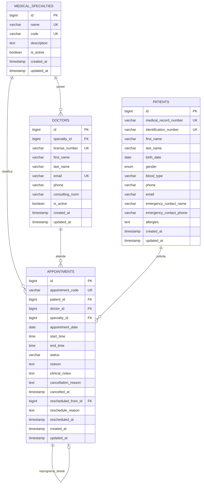

# Documentación Técnica: Rama `feature/docker-mysql-schema`

**Proyecto:** Sistema de Información Hospitalaria (HIS) - Módulo de Control de Citas Médicas  
**Rama:** `feature/docker-mysql-schema`  
**Fecha de Implementación:** Septiembre 2026  
**Tecnologías:** Docker Compose, MySQL 8.0 (InnoDB, utf8mb4), Laravel 12 (Eloquent, Migraciones, Seeders)

---

## 1. Resumen Ejecutivo

En esta rama se implementó la arquitectura de persistencia y el entorno de contenedores para el sistema hospitalario:
1. **Contenedor Docker MySQL 8.0**: Servicio parametrizado con persistencia mediante volúmenes (`his_mysql_data`), comprobación de salud (`healthcheck`) y script de inicialización automática.
2. **Esquema Relacional de Base de Datos**: Creación de las tablas `patients`, `doctors`, `medical_specialties` y `appointments`, con restricciones de llaves foráneas e índices compuestos para optimizar la detección de traslapes en las agendas médicas.
3. **Datos Semilla Mínimos (Seeds)**: Conjunto de datos representativos cargados tanto por DDL nativo en `init.sql` como por seeders idempotentes de Laravel (`firstOrCreate`) cubriendo el ciclo de vida de agendamiento, reprogramación y cancelación.

---

## 2. Diagrama Entidad-Relación (ERD)



---

## 3. Diccionario de Datos

### 3.1. Tabla: `medical_specialties`
Especialidades médicas del centro hospitalario.

| Campo | Tipo | Nulo | Descripción |
| :--- | :--- | :---: | :--- |
| `id` | `BIGINT UNSIGNED` | No | Llave primaria auto-incremental. |
| `name` | `VARCHAR(100)` | No | Nombre de la especialidad (Único). Ej: "Cardiología". |
| `code` | `VARCHAR(20)` | No | Código institucional (Único). Ej: "CARD-01". |
| `description` | `TEXT` | Sí | Descripción clínica o alcance del departamento. |
| `is_active` | `TINYINT(1)` | No | Indicador de disponibilidad (1 = Activo, 0 = Inactivo). Por defecto: 1. |
| `created_at` / `updated_at` | `TIMESTAMP` | Sí | Auditoría de creación y última actualización. |

### 3.2. Tabla: `doctors`
Personal médico facultado para atender citas en el hospital.

| Campo | Tipo | Nulo | Descripción |
| :--- | :--- | :---: | :--- |
| `id` | `BIGINT UNSIGNED` | No | Llave primaria auto-incremental. |
| `specialty_id` | `BIGINT UNSIGNED` | No | Llave foránea que referencia a `medical_specialties(id)`. |
| `license_number` | `VARCHAR(50)` | No | Número de colegiado médico (Único). Ej: "COL-10294". |
| `first_name` | `VARCHAR(100)` | No | Nombres del profesional. |
| `last_name` | `VARCHAR(100)` | No | Apellidos del profesional. |
| `email` | `VARCHAR(150)` | No | Correo institucional del médico (Único). |
| `phone` | `VARCHAR(30)` | Sí | Teléfono directo o extensión interna. |
| `consulting_room` | `VARCHAR(50)` | Sí | Ubicación o número de consultorio asignado (Ej: "Edificio A - Consultorio 204"). |
| `is_active` | `TINYINT(1)` | No | Estado del médico en plantilla (1 = En servicio, 0 = De baja). |

### 3.3. Tabla: `patients`
Expedientes clínicos de pacientes atendidos en la institución.

| Campo | Tipo | Nulo | Descripción |
| :--- | :--- | :---: | :--- |
| `id` | `BIGINT UNSIGNED` | No | Llave primaria auto-incremental. |
| `medical_record_number` | `VARCHAR(50)` | No | Código único de historia clínica / expediente (Ej: "EXP-2026-0001"). |
| `identification_number` | `VARCHAR(50)` | No | Documento de identificación nacional DPI / DNI / Pasaporte (Único). |
| `first_name` | `VARCHAR(100)` | No | Nombres del paciente. |
| `last_name` | `VARCHAR(100)` | No | Apellidos del paciente. |
| `birth_date` | `DATE` | No | Fecha de nacimiento para cálculo dinámico de edad. |
| `gender` | `ENUM('male','female','other')` | No | Género del paciente. |
| `blood_type` | `VARCHAR(10)` | Sí | Grupo sanguíneo y factor RH (Ej: "O+", "A-"). |
| `phone` | `VARCHAR(30)` | No | Teléfono de contacto principal del paciente. |
| `email` | `VARCHAR(150)` | Sí | Correo electrónico para notificaciones. |
| `emergency_contact_name` | `VARCHAR(150)` | Sí | Nombre del responsable o contacto de emergencia. |
| `emergency_contact_phone`| `VARCHAR(30)` | Sí | Teléfono del contacto de emergencia. |
| `allergies` | `TEXT` | Sí | Alergias a medicamentos o sustancias (Crítico para triaje). |

### 3.4. Tabla: `appointments`
Registro central de citas médicas con trazabilidad de ciclo de vida completo.

| Campo | Tipo | Nulo | Descripción |
| :--- | :--- | :---: | :--- |
| `id` | `BIGINT UNSIGNED` | No | Llave primaria auto-incremental. |
| `appointment_code` | `VARCHAR(30)` | No | Código visible y alfanumérico para el paciente (Ej: "CITA-202609-001"). |
| `patient_id` | `BIGINT UNSIGNED` | No | Llave foránea hacia `patients(id)`. |
| `doctor_id` | `BIGINT UNSIGNED` | No | Llave foránea hacia `doctors(id)`. |
| `specialty_id` | `BIGINT UNSIGNED` | No | Llave foránea hacia `medical_specialties(id)`. |
| `appointment_date` | `DATE` | No | Fecha programada para la consulta médica. |
| `start_time` | `TIME` | No | Hora de inicio de la cita. |
| `end_time` | `TIME` | No | Hora de finalización prevista. |
| `status` | `VARCHAR(30)` | No | Estado: `pending`, `confirmed`, `rescheduled`, `cancelled`, `attended`, `no_show`. |
| `reason` | `TEXT` | No | Motivo de la cita o sintomatología reportada. |
| `clinical_notes` | `TEXT` | Sí | Observaciones preliminares de enfermería o triaje. |
| `cancellation_reason` | `TEXT` | Sí | Justificación obligatoria en caso de cancelación de la cita. |
| `cancelled_at` | `TIMESTAMP` | Sí | Fecha y hora exacta de la cancelación. |
| `rescheduled_from_id` | `BIGINT UNSIGNED` | Sí | Llave foránea auto-referencial a la cita anterior si fue reprogramada. |
| `reschedule_reason` | `TEXT` | Sí | Motivo obligatorio por el cual se modificó la fecha de la cita. |
| `rescheduled_at` | `TIMESTAMP` | Sí | Fecha y hora de la reprogramación. |

---

## 4. Índices y Optimización de Consultas

Se crearon índices específicos para garantizar tiempos de respuesta rápidos en bases de datos con alto volumen de atención:

1. **`idx_doctor_schedule (doctor_id, appointment_date, start_time)`**:
   - Optimiza la consulta de comprobación de traslapes en tiempo real cuando un recepcionista o la API intenta agendar una cita para un médico determinado.
2. **`idx_patient_schedule (patient_id, appointment_date)`**:
   - Permite consultar rápidamente el historial y las próximas citas programadas de un paciente.
3. **`idx_appointment_status (status)`**:
   - Agiliza los filtros de las vistas del panel de control por estados (`pending`, `confirmed`, `rescheduled`, `cancelled`).

---

## 5. Arquitectura del Contenedor MySQL en Docker

El archivo [`docker-compose.yml`](../../docker-compose.yml) orquesta el contenedor `his_mysql_db` con las siguientes características:

- **Imagen:** `mysql:8.0` oficial de Docker Hub.
- **Variables de Entorno:**
  - `MYSQL_DATABASE`: `his_hospital`
  - `MYSQL_USER`: `his_user`
  - `MYSQL_PASSWORD`: `his_password`
  - `MYSQL_ROOT_PASSWORD`: `root_secret`
- **Persistencia:** Volumen Docker nombrado `his_mysql_data:/var/lib/mysql`. Los datos no se pierden al reiniciar los contenedores.
- **Script de Inicialización:** Montaje de lectura de [`docker/mysql/init.sql`](../../docker/mysql/init.sql) en `/docker-entrypoint-initdb.d/init.sql`. En la primera inicialización del contenedor, MySQL ejecuta este archivo automáticamente.
- **Healthcheck:**
  ```yaml
  test: ["CMD", "mysqladmin", "ping", "-h", "localhost", "-u", "root", "-p${DB_ROOT_PASSWORD:-root_secret}"]
  interval: 10s
  timeout: 5s
  retries: 5
  ```
  Permite que el contenedor de Laravel (`his_laravel_app`) espere a que MySQL esté 100% listo para recibir conexiones antes de iniciar.

---

## 6. Resumen de Datos Semilla Mínimos (Seeds)

| Entidad | Registros Semilla | Detalles Clave |
| :--- | :---: | :--- |
| **Especialidades** | 4 | Cardiología, Pediatría, Traumatología, Medicina General. |
| **Médicos** | 4 | Dr. Carlos Mendoza, Dra. Ana Gómez, Dr. Roberto Castillo, Dra. Lucía Fernández. Con colegiados y consultorios designados. |
| **Pacientes** | 3 | Mario López (EXP-2026-0001), Elena Morales (EXP-2026-0002), Jorge Herrera (EXP-2026-0003). |
| **Citas Médicas** | 3 | - `CITA-202609-001`: Estado `confirmed`.<br>- `CITA-202609-002`: Estado `rescheduled` (con motivo y timestamp de reprogramación).<br>- `CITA-202609-003`: Estado `cancelled` (con motivo y timestamp de cancelación). |

---

## 7. Instrucciones para Ejecución y Pruebas

### Levantar únicamente la Base de Datos MySQL:
```bash
docker compose up -d db
```

### Verificar el estado del contenedor:
```bash
docker compose ps db
```

### Conectarse por CLI al contenedor de MySQL:
```bash
docker compose exec db mysql -u his_user -phis_password his_hospital
```

### Ejecutar consultas de prueba en MySQL:
```sql
-- Verificar citas con sus médicos y pacientes
SELECT 
    a.appointment_code, 
    CONCAT(p.first_name, ' ', p.last_name) AS paciente,
    CONCAT(d.first_name, ' ', d.last_name) AS doctor,
    s.name AS especialidad,
    a.appointment_date,
    a.start_time,
    a.status
FROM appointments a
JOIN patients p ON a.patient_id = p.id
JOIN doctors d ON a.doctor_id = d.id
JOIN medical_specialties s ON a.specialty_id = s.id;
```
