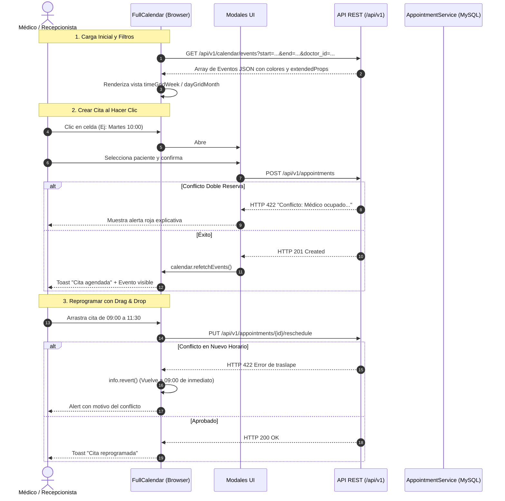

# Documentación Técnica: Rama `feature/fullcalendar-ui`

**Módulo:** Interfaz Gráfica Interactiva con FullCalendar v6 (HIS)  
**Rama:** `feature/fullcalendar-ui`  
**Fecha de Implementación:** Septiembre 2026  
**Tecnologías:** FullCalendar v6, Vanilla JavaScript (ES6+ async/await), API REST Laravel 12, Tailwind CSS  

---

## 1. Resumen de lo Implementado

En esta rama se desarrolló la integración visual completa de **FullCalendar v6** conectada de extremo a extremo con la **API REST**:

1. **Consumo de Eventos en Tiempo Real (`/api/v1/calendar/events`)**:
   - Feed dinámico de eventos que envía los rangos `start` y `end` consultados por FullCalendar.
   - Filtrado dinámico por médico especialista sin recargar la página.
   - Codificación visual de eventos según el estado de la cita (`AppointmentStatus`):
     - 🟠 **Pendiente**: Ámbar (`#f59e0b`)
     - 🟢 **Confirmada**: Verde esmeralda (`#10b981`)
     - 🔵 **Reprogramada**: Azul (`#3b82f6`)
     - 🟣 **Atendida**: Morado (`#8b5cf6`)
     - 🔴 **Cancelada**: Rojo (`#ef4444`)
     - ⚪ **No Asistió**: Gris (`#6b7280`)

2. **Crear Cita al Hacer Clic (`select` / `dateClick`)**:
   - Al hacer clic o arrastrar sobre cualquier celda de horario o día, se abre el modal `#createModal`.
   - La fecha, la hora de inicio y la hora de fin estimada (30 minutos por defecto) se precargan automáticamente.
   - Envío asíncrono vía `POST /api/v1/appointments`.
   - Si el servidor detecta conflicto de doble reserva (médico o paciente ocupado), se despliega una alerta con el mensaje explicativo devuelto por el backend.
   - Tras el éxito, se actualiza el calendario con `calendar.refetchEvents()` y se notifica con un Toast.

3. **Mostrar Detalle al Hacer Clic en Evento (`eventClick`)**:
   - Al pulsar cualquier cita en el calendario se abre el modal `#detailModal`.
   - Muestra el código de cita, badge de estado, datos del paciente, médico, especialidad, horario, motivo y notas de triaje/trazabilidad.
   - Botones de acción rápida integrados:
     - **Confirmar Cita** (PATCH `/api/v1/appointments/{id}/status`).
     - **Marcar Atendida** (PATCH `/api/v1/appointments/{id}/status`).
     - **Cancelar Cita** (PUT `/api/v1/appointments/{id}/cancel` con prompt de justificación).
     - **Ver Expediente Completo** (Enlace directo a `/appointments/{id}`).

4. **Reprogramar con Drag & Drop (`eventDrop` y `eventResize`)**:
   - Arrastrar un evento a otro día o bloque horario activa la función `handleEventReschedule()`.
   - Redimensionar la duración del evento activa la reprogramación de hora fin.
   - Solicita el motivo de reprogramación de forma interactiva.
   - Envía `PUT /api/v1/appointments/{id}/reschedule`.
   - **Manejo de conflictos y reversión inmediata (`info.revert()`)**: Si el médico o el paciente ya tienen otra cita en el nuevo horario o la cita está en un estado terminal, el servidor rechaza con HTTP 422 y FullCalendar revierte automáticamente la cita a su celda original.

---

## 2. Diagrama de Interacción del Calendario



---

## 3. Especificación del Feed de Eventos (`GET /api/v1/calendar/events`)

### Parámetros de Consulta (Query):
- `start`: Timestamp ISO de inicio de la vista visible del calendario.
- `end`: Timestamp ISO de fin de la vista visible.
- `doctor_id` *(opcional)*: ID del médico para filtrar la agenda.
- `status` *(opcional)*: Estado específico de citas.

### Estructura del Objeto Evento FullCalendar:
```json
[
  {
    "id": "1",
    "title": "Mario López - Dr. Carlos Mendoza",
    "start": "2026-09-25T09:00:00",
    "end": "2026-09-25T09:30:00",
    "backgroundColor": "#10b981",
    "borderColor": "#059669",
    "textColor": "#ffffff",
    "editable": true,
    "extendedProps": {
      "code": "CITA-202609-001",
      "status": "confirmed",
      "status_label": "Confirmada",
      "badge_color": "bg-emerald-100 text-emerald-800 border-emerald-200",
      "patient_name": "Mario López",
      "patient_id": 1,
      "doctor_name": "Dr. Carlos Mendoza",
      "doctor_id": 1,
      "specialty_name": "Cardiología",
      "reason": "Chequeo rutinario por presión arterial elevada.",
      "clinical_notes": "Paciente refiere mareos esporádicos al despertar.",
      "start_time": "09:00",
      "end_time": "09:30",
      "date": "2026-09-25"
    }
  }
]
```

---

## 4. Archivos Creados y Modificados en Esta Rama

```
app/
├── Http/Controllers/
│   ├── Api/V1/AppointmentApiController.php   # [MODIFICADO] Endpoint calendarEvents() con feed FullCalendar
│   └── Web/AppointmentWebController.php     # [MODIFICADO] Método calendar() para renderizar la vista
resources/views/
├── appointments/
│   ├── calendar.blade.php                   # [NUEVO] Vista principal interactiva con FullCalendar v6
│   └── index.blade.php                      # [MODIFICADO] Botón para alternar a la vista de calendario
└── layouts/app.blade.php                     # [MODIFICADO] Enlace 'Calendario' en la barra de navegación
routes/
├── api.php                                   # [MODIFICADO] Ruta GET /api/v1/calendar/events
└── web.php                                   # [MODIFICADO] Ruta GET /appointments/calendar
doc/
├── README.md                                 # [MODIFICADO] Índice de documentación del proyecto
└── fullcalendar-ui/
    └── README.md                             # [NUEVO] Manual técnico de integración con FullCalendar
```

---

## 5. Instrucciones de Prueba Manual de la UI

1. Navega a `http://localhost:8080/appointments/calendar` (o haz clic en **Calendario** en la barra superior).
2. **Creación**: Haz clic en cualquier casilla de hora en la vista semanal. Completa el formulario del modal y observa cómo la cita aparece con su color de estado correspondiente.
3. **Detalle**: Haz clic sobre la cita recién creada para abrir el modal de detalles y consultar los datos clínicos.
4. **Drag & Drop**: Arrastra la cita hacia otro día o bloque de horario:
   - Si el horario está libre, ingresa el motivo y confirma la reprogramación.
   - Si intentas arrastrarla encima de otra cita existente del mismo doctor, observa cómo la alerta de conflicto se dispara y el evento regresa automáticamente a su horario previo (`info.revert()`).
