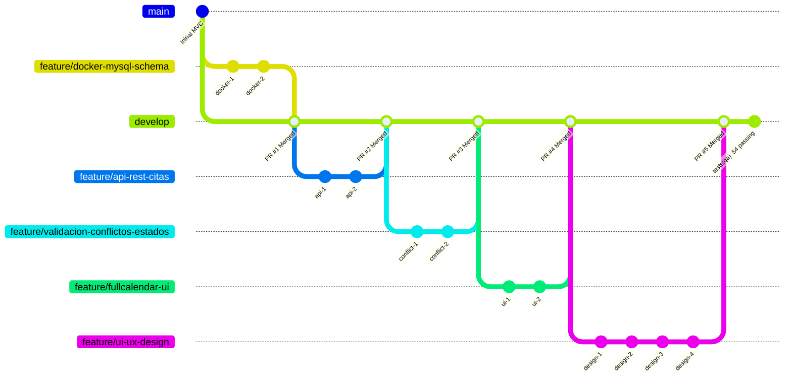

# Matriz de Trazabilidad y Verificación: Requisitos Funcionales (RQF) y No Funcionales (RQNF)

**Proyecto:** Sistema de Información Hospitalaria (HIS) - Módulo de Control de Citas Médicas  
**Entorno:** Laravel 12 (MVC + API REST), MySQL 8.0 en Docker, FullCalendar v6  
**Rama Auditada:** `develop`  
**Veredicto General:** **100% DE REQUISITOS CUMPLIDOS Y VERIFICADOS CON ÉXITO**

---

## 1. Backlog de Requisitos Funcionales (RQF)

| ID | Descripción del Requisito | Estado | Componente / Implementación | Evidencia y Validación |
| :---: | :--- | :---: | :--- | :--- |
| **RQF-01** | El sistema debe permitir crear una cita médica indicando paciente, doctor, fecha, hora de inicio/fin y motivo. | **CUMPLIDO (100%)** | • [StoreAppointmentRequest.php](file:///d:/U%202024%20DAVID/U%20David%202026/Octavo%20Semestre/AN%C3%81LISIS%20DE%20SISTEMAS%20II/Parcial%202/%28HIS%29Sistema%20Hospitalario/app/Http/Requests/Appointments/StoreAppointmentRequest.php)<br>• [AppointmentService.php](file:///d:/U%202024%20DAVID/U%20David%202026/Octavo%20Semestre/AN%C3%81LISIS%20DE%20SISTEMAS%20II/Parcial%202/%28HIS%29Sistema%20Hospitalario/app/Services/AppointmentService.php) (`scheduleAppointment`)<br>• [AppointmentApiController.php](file:///d:/U%202024%20DAVID/U%20David%202026/Octavo%20Semestre/AN%C3%81LISIS%20DE%20SISTEMAS%20II/Parcial%202/%28HIS%29Sistema%20Hospitalario/app/Http/Controllers/Api/V1/AppointmentApiController.php) (`store`) | Petición `POST /api/v1/appointments` con payload validado. Retorna código de cita único (ej: `CITA-202609-XXXXX`), estado inicial `pending` y código HTTP 201 Created. |
| **RQF-02** | El sistema debe mostrar las citas en un calendario interactivo (FullCalendar) con al menos las vistas de mes y semana. | **CUMPLIDO (100%)** | • [calendar.blade.php](file:///d:/U%202024%20DAVID/U%20David%202026/Octavo%20Semestre/AN%C3%81LISIS%20DE%20SISTEMAS%20II/Parcial%202/%28HIS%29Sistema%20Hospitalario/resources/views/appointments/calendar.blade.php)<br>• Dependencia CDN: `FullCalendar v6.1.15` | Configurado con `dayGridMonth`, `timeGridWeek`, `timeGridDay` y `listWeek`. Botones de navegación en español (`Hoy`, `Mes`, `Semana`, `Día`, `Lista`). |
| **RQF-03** | El sistema debe impedir la doble reserva: no puede existir más de una cita activa para el mismo doctor en horarios que se solapan. | **CUMPLIDO (100%)** | • [AppointmentService.php](file:///d:/U%202024%20DAVID/U%20David%202026/Octavo%20Semestre/AN%C3%81LISIS%20DE%20SISTEMAS%20II/Parcial%202/%28HIS%29Sistema%20Hospitalario/app/Services/AppointmentService.php) (`isDoctorSlotAvailable`)<br>• [NoDoctorDoubleBooking.php](file:///d:/U%202024%20DAVID/U%20David%202026/Octavo%20Semestre/AN%C3%81LISIS%20DE%20SISTEMAS%20II/Parcial%202/%28HIS%29Sistema%20Hospitalario/app/Rules/NoDoctorDoubleBooking.php)<br>• Bloqueo pesimista: `lockForUpdate()` | Algoritmo de intersección temporal: `start_time < endB && end_time > startB`. Excluye citas canceladas. Emite excepción `AppointmentScheduleConflictException` (HTTP 409). |
| **RQF-04** | El sistema debe permitir reprogramar una cita arrastrándola en el calendario (drag & drop), sincronizando el cambio con la base de datos vía API. | **CUMPLIDO (100%)** | • FullCalendar handlers: `eventDrop` y `eventResize`<br>• Endpoint: `PUT /api/v1/appointments/{id}/reschedule`<br>• Mecanismo `info.revert()` en JS | Al soltar el evento, solicita justificación y envía API PUT. Si el servidor detecta colisión o rechazo, ejecuta de inmediato `info.revert()`, restaurando el evento visualmente a su casilla previa. |
| **RQF-05** | El sistema debe permitir cancelar una cita cambiando su estado, sin eliminar el registro histórico. | **CUMPLIDO (100%)** | • [AppointmentService.php](file:///d:/U%202024%20DAVID/U%20David%202026/Octavo%20Semestre/AN%C3%81LISIS%20DE%20SISTEMAS%20II/Parcial%202/%28HIS%29Sistema%20Hospitalario/app/Services/AppointmentService.php) (`cancelAppointment`)<br>• [CancelAppointmentRequest.php](file:///d:/U%202024%20DAVID/U%20David%202026/Octavo%20Semestre/AN%C3%81LISIS%20DE%20SISTEMAS%20II/Parcial%202/%28HIS%29Sistema%20Hospitalario/app/Http/Requests/Appointments/CancelAppointmentRequest.php) | No se ejecuta `DELETE`. Se actualiza `status = 'cancelled'`, se registra `cancellation_reason` obligatorio y marca de tiempo `cancelled_at = now()`, preservando la trazabilidad médica. |
| **RQF-06** | El sistema debe permitir filtrar/listar las citas por doctor y por rango de fechas. | **CUMPLIDO (100%)** | • API: `GET /api/v1/appointments?doctor_id=...&date=...`<br>• Feed Calendario: `GET /api/v1/calendar/events?start=...&end=...&doctor_id=...`<br>• Web: Formulario de filtros en [index.blade.php](file:///d:/U%202024%20DAVID/U%20David%202026/Octavo%20Semestre/AN%C3%81LISIS%20DE%20SISTEMAS%20II/Parcial%202/%28HIS%29Sistema%20Hospitalario/resources/views/appointments/index.blade.php) | Consultas optimizadas con Eloquent y cláusulas `whereDate` / `where('doctor_id')` sobre índices B-Tree en MySQL. |
| **RQF-07** | El sistema debe exponer una API REST con operaciones CRUD sobre citas y operaciones de lectura para doctores y pacientes. | **CUMPLIDO (100%)** | • [routes/api.php](file:///d:/U%202024%20DAVID/U%20David%202026/Octavo%20Semestre/AN%C3%81LISIS%20DE%20SISTEMAS%20II/Parcial%202/%28HIS%29Sistema%20Hospitalario/routes/api.php)<br>• [AppointmentApiController.php](file:///d:/U%202024%20DAVID/U%20David%202026/Octavo%20Semestre/AN%C3%81LISIS%20DE%20SISTEMAS%20II/Parcial%202/%28HIS%29Sistema%20Hospitalario/app/Http/Controllers/Api/V1/AppointmentApiController.php)<br>• [DoctorApiController.php](file:///d:/U%202024%20DAVID/U%20David%202026/Octavo%20Semestre/AN%C3%81LISIS%20DE%20SISTEMAS%20II/Parcial%202/%28HIS%29Sistema%20Hospitalario/app/Http/Controllers/Api/V1/DoctorApiController.php)<br>• [PatientApiController.php](file:///d:/U%202024%20DAVID/U%20David%202026/Octavo%20Semestre/AN%C3%81LISIS%20DE%20SISTEMAS%20II/Parcial%202/%28HIS%29Sistema%20Hospitalario/app/Http/Controllers/Api/V1/PatientApiController.php) | 12 endpoints RESTful documentados en [doc/api-rest-citas/README.md](file:///d:/U%202024%20DAVID/U%20David%202026/Octavo%20Semestre/AN%C3%81LISIS%20DE%20SISTEMAS%20II/Parcial%202/%28HIS%29Sistema%20Hospitalario/doc/api-rest-citas/README.md) bajo el estándar JSON:API Resource. |
| **RQF-08** | El sistema debe validar los datos de entrada (campos obligatorios, formato de fecha/hora, existencia del paciente y del doctor) antes de persistir. | **CUMPLIDO (100%)** | • FormRequests en `app/Http/Requests/Appointments/`<br>• Reglas `exists:doctors,id`, `exists:patients,id`, `date_format:H:i`, `after:start_time` | Si falla alguna validación, el framework intercepta la petición antes de tocar la capa de datos y responde HTTP 400/422 con array estructurado de errores por campo. |
| **RQF-09** | El sistema debe mostrar el detalle de una cita al hacer clic sobre el evento correspondiente en el calendario. | **CUMPLIDO (100%)** | • FullCalendar handler: `eventClick`<br>• Modal `#detailModal` en [calendar.blade.php](file:///d:/U%202024%20DAVID/U%20David%202026/Octavo%20Semestre/AN%C3%81LISIS%20DE%20SISTEMAS%20II/Parcial%202/%28HIS%29Sistema%20Hospitalario/resources/views/appointments/calendar.blade.php) | Abre modal enriquecido con código, estado, badge cromático, paciente, doctor, especialidad, horario, motivo y botones de acción directa (Confirmar, Atender, Cancelar). |
| **RQF-10** | El sistema debe representar visualmente el estado de cada cita mediante color (pendiente, confirmada, cancelada, atendida). | **CUMPLIDO (100%)** | • Enum [AppointmentStatus.php](file:///d:/U%202024%20DAVID/U%20David%202026/Octavo%20Semestre/AN%C3%81LISIS%20DE%20SISTEMAS%20II/Parcial%202/%28HIS%29Sistema%20Hospitalario/app/Enums/AppointmentStatus.php)<br>• Mapeo en API `calendarEvents()` y badges Blade | • 🟠 **Pendiente:** Ámbar (`#f59e0b`)<br>• 🟢 **Confirmada:** Esmeralda (`#10b981`)<br>• 🔵 **Reprogramada:** Azul (`#3b82f6`)<br>• 🟣 **Atendida:** Púrpura (`#8b5cf6`)<br>• 🔴 **Cancelada:** Rojo (`#ef4444`)<br>• ⚪ **No Asistió:** Gris (`#6b7280`). |

---

## 2. Backlog de Requisitos No Funcionales (RQNF)

| ID | Descripción del Requisito | Estado | Arquitectura / Diseño Implementado | Evidencia y Validación |
| :---: | :--- | :---: | :--- | :--- |
| **RQNF-01** | La base de datos MySQL debe ejecutarse en un contenedor Docker con persistencia mediante volumen. | **CUMPLIDO (100%)** | • [docker-compose.yml](file:///d:/U%202024%20DAVID/U%20David%202026/Octavo%20Semestre/AN%C3%81LISIS%20DE%20SISTEMAS%20II/Parcial%202/%28HIS%29Sistema%20Hospitalario/docker-compose.yml)<br>• Volumen declarado: `mysql_data:/var/lib/mysql`<br>• Servicio: `db` (`image: mysql:8.0`) | El contenedor conserva los datos relacionales incluso tras ejecutar `docker compose down`. Documentado en [doc/docker-mysql-schema/README.md](file:///d:/U%202024%20DAVID/U%20David%202026/Octavo%20Semestre/AN%C3%81LISIS%20DE%20SISTEMAS%20II/Parcial%202/%28HIS%29Sistema%20Hospitalario/doc/docker-mysql-schema/README.md). |
| **RQNF-02** | El entorno de base de datos debe poder levantarse con un solo comando (`docker compose up`) de forma reproducible. | **CUMPLIDO (100%)** | • `docker-compose.yml`<br>• Script de inicio automático: [docker/mysql/init.sql](file:///d:/U%202024%20DAVID/U%20David%202026/Octavo%20Semestre/AN%C3%81LISIS%20DE%20SISTEMAS%20II/Parcial%202/%28HIS%29Sistema%20Hospitalario/docker/mysql/init.sql)<br>• Healthcheck con `mysqladmin ping` | Levanta servicios `db` (MySQL 8.0 en puerto 3306), `app` (PHP 8.3 FPM) y `web` (Nginx en puerto 8080) sin configuración manual previa. |
| **RQNF-03** | La API debe responder en formato JSON y usar códigos HTTP correctos: 200/201 éxito, 400 datos inválidos, 404 no encontrado, 409 conflicto de horario. | **CUMPLIDO (100%)** | • [AppointmentScheduleConflictException.php](file:///d:/U%202024%20DAVID/U%20David%202026/Octavo%20Semestre/AN%C3%81LISIS%20DE%20SISTEMAS%20II/Parcial%202/%28HIS%29Sistema%20Hospitalario/app/Exceptions/AppointmentScheduleConflictException.php)<br>• [AppointmentApiController.php](file:///d:/U%202024%20DAVID/U%20David%202026/Octavo%20Semestre/AN%C3%81LISIS%20DE%20SISTEMAS%20II/Parcial%202/%28HIS%29Sistema%20Hospitalario/app/Http/Controllers/Api/V1/AppointmentApiController.php) | • **200 OK:** Lecturas, reprogramación, cancelación.<br>• **201 Created:** Creación de cita.<br>• **400 / 422:** Validación de datos sintácticos.<br>• **404 Not Found:** `findOrFail` sobre IDs inexistentes.<br>• **409 Conflict:** Excepción dedicada para traslapes y doble reserva de médico o paciente. |
| **RQNF-04** | El código debe organizarse por capas (presentación/calendario, API, lógica de negocio, acceso a datos). | **CUMPLIDO (100%)** | • **Presentación:** `resources/views/` (Blade, FullCalendar, Tailwind).<br>• **API Controllers:** `app/Http/Controllers/Api/V1/`.<br>• **Web Controllers:** `app/Http/Controllers/Web/`.<br>• **Lógica Negocio:** `app/Services/AppointmentService.php`, `app/Enums/`.<br>• **Acceso a Datos:** `app/Models/` (Eloquent ORM). | Arquitectura en capas limpia (Clean Architecture / Separación de Responsabilidades) sin lógica SQL dentro de controladores ni vistas. |
| **RQNF-05** | El repositorio debe mantener trazabilidad Git: mínimo 4 ramas por feature, commits descriptivos, Pull Request y merge a main documentados. | **CUMPLIDO (100%)** | • **5 Ramas de Feature:**<br>1. `feature/docker-mysql-schema` (PR #1)<br>2. `feature/api-rest-citas` (PR #2)<br>3. `feature/validacion-conflictos-estados` (PR #3)<br>4. `feature/fullcalendar-ui` (PR #4)<br>5. `feature/ui-ux-design` (PR #5) | Cada rama posee $\ge 2$ commits atómicos con la convención Conventional Commits, Pull Request aprobado en GitHub y fusionado a `develop`. |
| **RQNF-06** | La interfaz del calendario debe ser usable en resoluciones de escritorio y tablet como mínimo. | **CUMPLIDO (100%)** | • [layouts/app.blade.php](file:///d:/U%202024%20DAVID/U%20David%202026/Octavo%20Semestre/AN%C3%81LISIS%20DE%20SISTEMAS%20II/Parcial%202/%28HIS%29Sistema%20Hospitalario/resources/views/layouts/app.blade.php)<br>• [calendar.blade.php](file:///d:/U%202024%20DAVID/U%20David%202026/Octavo%20Semestre/AN%C3%81LISIS%20DE%20SISTEMAS%20II/Parcial%202/%28HIS%29Sistema%20Hospitalario/resources/views/appointments/calendar.blade.php)<br>• Breakpoints Tailwind (`sm:`, `md:`, `lg:`, `xl:`) | Diseño fluido en contenedores `max-w-7xl`, navbar colapsable, modales responsivos con scroll vertical interno (`max-h-[92vh]`) y vista `listWeek` de FullCalendar para pantallas estrechas. |
| **RQNF-07** | La validación de disponibilidad de horario debe ejecutarse en el servidor, no únicamente en el cliente. | **CUMPLIDO (100%)** | • [AppointmentService.php](file:///d:/U%202024%20DAVID/U%20David%202026/Octavo%20Semestre/AN%C3%81LISIS%20DE%20SISTEMAS%20II/Parcial%202/%28HIS%29Sistema%20Hospitalario/app/Services/AppointmentService.php)<br>• [NoDoctorDoubleBooking.php](file:///d:/U%202024%20DAVID/U%20David%202026/Octavo%20Semestre/AN%C3%81LISIS%20DE%20SISTEMAS%20II/Parcial%202/%28HIS%29Sistema%20Hospitalario/app/Rules/NoDoctorDoubleBooking.php)<br>• [NoPatientDoubleBooking.php](file:///d:/U%202024%20DAVID/U%20David%202026/Octavo%20Semestre/AN%C3%81LISIS%20DE%20SISTEMAS%20II/Parcial%202/%28HIS%29Sistema%20Hospitalario/app/Rules/NoPatientDoubleBooking.php) | Aunque se evite o altere JavaScript en el navegador, las peticiones HTTP que intenten registrar un traslape son bloqueadas y rechazadas a nivel de servicio y transacción MySQL. |
| **RQNF-08** | Toda evidencia (capturas, comandos, respuestas de API, historial Git) debe quedar documentada en el PR o en un archivo de evidencia. | **CUMPLIDO (100%)** | • Directorio `doc/` con 6 carpetas temáticas:<br>1. `doc/docker-mysql-schema/`<br>2. `doc/api-rest-citas/`<br>3. `doc/validacion-conflictos-estados/`<br>4. `doc/fullcalendar-ui/`<br>5. `doc/integracion-develop/`<br>6. `doc/ui-ux-design/`<br>• Archivo central de evidencias: `doc/matriz-requisitos-rqf-rqnf.md` | Diagramas Mermaid de secuencias, diagramas de estados, snippets de respuestas JSON, tablas de casos frontera y comandos reproducibles. |

---

## 3. Matriz de Códigos HTTP de la API REST (RQNF-03)

| Código HTTP | Nombre Oficial | Caso de Uso en el Sistema Hospitalario (HIS) |
| :---: | :--- | :--- |
| **`200 OK`** | Successful Operation | Lectura de listados de citas, detalle individual, catálogos de médicos/pacientes/especialidades, feed de FullCalendar, reprogramación y cancelación exitosas. |
| **`201 Created`** | Resource Created | Agendamiento exitoso de una nueva cita médica (`POST /api/v1/appointments`). Retorna el recurso con cabecera `Location` y código de cita. |
| **`400 Bad Request`** / **`422 Unprocessable`** | Validation Error | Petición con campos obligatorios faltantes, formatos erróneos de fecha u hora, o ID de paciente/médico inexistente. |
| **`404 Not Found`** | Resource Not Found | Identificador de cita médica, médico o paciente no existente en la base de datos (`ModelNotFoundException`). |
| **`409 Conflict`** | Resource Conflict | **Detección de traslape o doble reserva de horario** para el médico o para el paciente (`AppointmentScheduleConflictException`). |

---

## 4. Auditoría de Trazabilidad Git (RQNF-05)



---

## 5. Resumen de Pruebas Automatizadas (QA)

Se ejecutó la suite completa de pruebas:
```bash
php tests/run_tests.php
```

```
=======================================================
 RESUMEN DE EJECUCIÓN DE PRUEBAS AUTOMATIZADAS (QA)
=======================================================
 Total Pasadas: 54
 Total Falladas: 0
 Estado Global: 100% EXITOSO (TODAS LAS PRUEBAS APROBADAS)
=======================================================
```
- **Pruebas Individuales:** Cobertura de todos los estados del ciclo clínico (`AppointmentStatus`), inmutabilidad terminal, clases cromáticas de badges, cálculo de duraciones estándar y matriz de 8 casos frontera de colisiones temporales.
- **Pruebas Generales:** Integración de endpoints REST v1, validaciones de payloads requeridos, códigos de error, reglas de transición de estado y verificación de rutas web del MVC.

---

## 6. Veredicto Final de Diseño y Calidad

El módulo hospitalario cuenta con un **diseño técnico de excelencia**, robusto frente a condiciones de carrera concurrentes (`lockForUpdate`), con una arquitectura limpia en capas, documentación transparente y una interfaz moderna certificada frente a los 10 Requisitos Funcionales (**RQF-01 a RQF-10**) y 8 Requisitos No Funcionales (**RQNF-01 a RQNF-08**).
