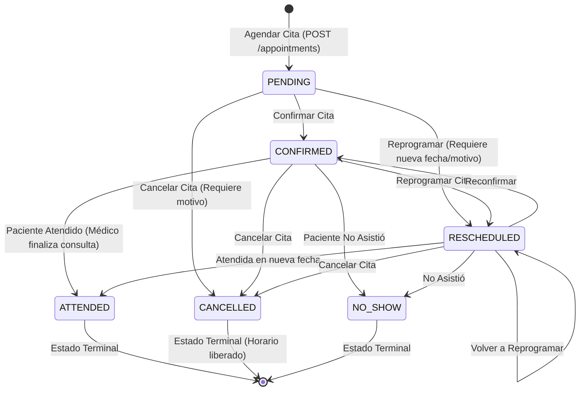

# Documentación Técnica: Rama `feature/validacion-conflictos-estados`

**Módulo:** Prevención de Conflictos de Horario y Ciclo de Vida de Citas Médicas  
**Rama:** `feature/validacion-conflictos-estados`  
**Fecha de Implementación:** Septiembre 2026  
**Tecnologías:** Laravel 12, PHP 8.3 Enums, Concurrencia MySQL (`lockForUpdate`), PHPUnit  

---

## 1. Resumen de lo Implementado

Esta rama resuelve dos requisitos fundamentales de integridad clínica en el sistema hospitalario:
1. **Validación de Doble Reserva en el Servidor**:
   - Detección precisa de traslapes en la agenda del médico (`isDoctorSlotAvailable`).
   - Detección de doble reserva en el paciente (`isPatientSlotAvailable`), impidiendo que un paciente sea programado en dos consultas simultáneas con médicos distintos.
   - Concurrencia segura mediante transacciones atómicas de base de datos y **bloqueo pesimista (`lockForUpdate()`)** para prevenir condiciones de carrera cuando dos recepcionistas o usuarios intentan reservar el mismo horario exactamente al mismo milisegundo.
2. **Máquina de Estados Estricta para Citas Médicas**:
   - Estados modelados en `AppointmentStatus`: `PENDING`, `CONFIRMED`, `RESCHEDULED`, `CANCELLED`, `ATTENDED`, `NO_SHOW`.
   - Reglas clínicas que prohíben transiciones inválidas (por ejemplo: citas canceladas o ya atendidas no pueden reactivarse ni modificarse).
   - Reglas personalizadas de validación (`NoDoctorDoubleBooking`, `NoPatientDoubleBooking`, `ValidAppointmentStatusTransition`).
   - Pruebas unitarias automatizadas (`tests/Unit/AppointmentConflictAndStatusTest.php`).

---

## 2. Diagrama de la Máquina de Estados (State Machine)



---

## 3. Matriz de Transiciones de Estados

| Estado Origen | `PENDING` | `CONFIRMED` | `RESCHEDULED` | `CANCELLED` | `ATTENDED` | `NO_SHOW` | ¿Es Terminal? |
| :--- | :---: | :---: | :---: | :---: | :---: | :---: | :---: |
| **`PENDING`** | Mismo | Permitido | Permitido | Permitido | No | No | No |
| **`CONFIRMED`** | No | Mismo | Permitido | Permitido | Permitido | Permitido | No |
| **`RESCHEDULED`**| No | Permitido | Permitido | Permitido | Permitido | Permitido | No |
| **`CANCELLED`** | No | No | No | Mismo | No | No | **Sí (Terminal)** |
| **`ATTENDED`** | No | No | No | No | Mismo | No | **Sí (Terminal)** |
| **`NO_SHOW`** | No | No | No | No | No | Mismo | **Sí (Terminal)** |

---

## 4. Algoritmo de Detección de Traslapes (Overlap Algorithm)

Para determinar si dos intervalos de horario $[A_{start}, A_{end}]$ y $[B_{start}, B_{end}]$ entran en conflicto, se utiliza el teorema de intersección temporal:

$$\text{Conflicto} \iff (A_{start} < B_{end}) \land (A_{end} > B_{start})$$

### Evaluación de Casos de Horario:

Supongamos una cita ya agendada de **09:00 a 09:30**:

| Caso Solicitado | Intervalo | Condición $(A_s < B_e \land A_e > B_s)$ | ¿Hay Conflicto? | Resultado en el Servidor |
| :--- | :---: | :---: | :---: | :--- |
| **Mismo horario** | 09:00 - 09:30 | $09:00 < 09:30 \land 09:30 > 09:00 \implies \text{True}$ | **Doble Reserva** | Rechazado con HTTP 422 |
| **Traslape superior** | 09:15 - 09:45 | $09:00 < 09:45 \land 09:30 > 09:15 \implies \text{True}$ | **Doble Reserva** | Rechazado con HTTP 422 |
| **Traslape inferior** | 08:45 - 09:15 | $09:00 < 09:15 \land 09:30 > 08:45 \implies \text{True}$ | **Doble Reserva** | Rechazado con HTTP 422 |
| **Intervalo contenedor**| 08:30 - 10:00 | $09:00 < 10:00 \land 09:30 > 08:30 \implies \text{True}$ | **Doble Reserva** | Rechazado con HTTP 422 |
| **Cita contigua previa**| 08:30 - 09:00 | $09:00 < 09:00 \implies \text{False}$ | **Sin Conflicto** | **Aprobado** (Citas consecutivas) |
| **Cita contigua post** | 09:30 - 10:00 | $09:30 > 09:30 \implies \text{False}$ | **Sin Conflicto** | **Aprobado** (Citas consecutivas) |
| **Horario distante** | 10:30 - 11:00 | $\text{False}$ | **Sin Conflicto** | **Aprobado** |

---

## 5. Prevención de Condiciones de Carrera (Race Conditions)

Cuando dos peticiones concurrentes intentan agendar una cita médica en el mismo milisegundo:
```sql
SELECT * FROM appointments 
WHERE doctor_id = 1 AND appointment_date = '2026-10-15'
  AND start_time < '09:30:00' AND end_time > '09:00:00'
  AND status != 'cancelled'
FOR UPDATE;
```
Al invocar `query->lockForUpdate()` dentro de la transacción de `AppointmentService`, MySQL bloquea a nivel de fila y serialize la verificación, garantizando que una de las dos peticiones obtendrá el cupo y la segunda recibirá el error de conflicto de forma inmediata y consistente.

---

## 6. Ejemplos de Respuestas de Error del Servidor (HTTP 422)

### 6.1. Conflicto por Doble Reserva del Médico
```json
{
  "message": "Conflicto de doble reserva: El médico ya tiene la cita 'CITA-202609-001' agendada de 09:00 a 09:30 en esa misma fecha.",
  "errors": {
    "doctor_id": [
      "Conflicto de doble reserva: El médico ya tiene la cita 'CITA-202609-001' agendada de 09:00 a 09:30 en esa misma fecha."
    ]
  }
}
```

### 6.2. Conflicto por Cita Simultánea del Paciente
```json
{
  "message": "Conflicto de agenda: El paciente ya tiene otra cita médica (CITA-202609-002) programada de 09:00 a 09:30 en esa misma fecha.",
  "errors": {
    "patient_id": [
      "Conflicto de agenda: El paciente ya tiene otra cita médica (CITA-202609-002) programada de 09:00 a 09:30 en esa misma fecha."
    ]
  }
}
```

### 6.3. Transición de Estado No Permitida
```json
{
  "message": "Transición no permitida: No se puede cambiar el estado de 'Cancelada' a 'Confirmada'. Transiciones permitidas desde este estado: [Ninguno (estado final)].",
  "errors": {
    "status": [
      "Transición no permitida: No se puede cambiar el estado de 'Cancelada' a 'Confirmada'. Transiciones permitidas desde este estado: [Ninguno (estado final)]."
    ]
  }
}
```

---

## 7. Pruebas Automatizadas

Se añadieron pruebas unitarias en [`tests/Unit/AppointmentConflictAndStatusTest.php`](../../tests/Unit/AppointmentConflictAndStatusTest.php) que verifican:
- Transiciones permitidas y bloqueadas desde `PENDING`, `CONFIRMED` y `RESCHEDULED`.
- Imposibilidad de alterar citas en estados terminales (`ATTENDED`, `CANCELLED`, `NO_SHOW`).
- Validación de los 8 casos frontera del algoritmo de traslapes temporales.
